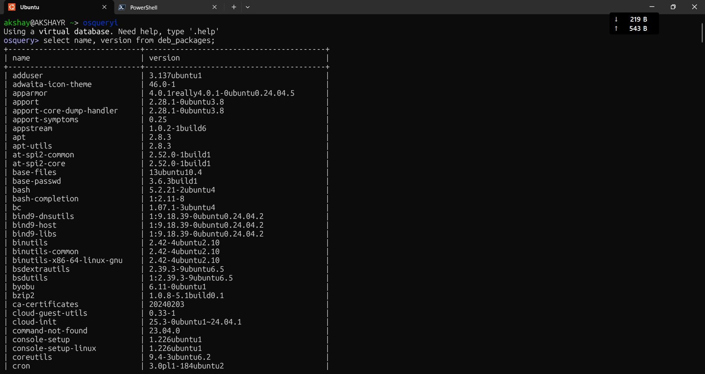

## Listing All Installed Packages

### Query Used
```sql
select name, version from deb_packages;
```

### What It Does
Pulls all installed packages on the system from the `deb_packages` table, showing the package name and its installed version.

### Screenshot


### Blue Team Relevance
- Useful for **software inventory** during incident response
- Helps detect **unauthorized or unexpected packages** installed on a system
- Can be used to verify if a **vulnerable version** of a package is present
