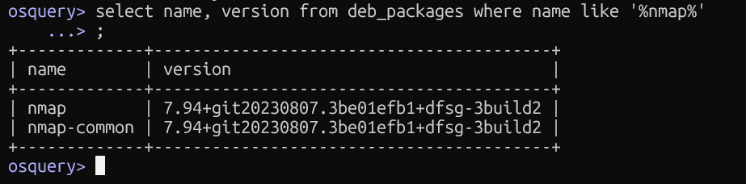

## Searching for a Specific Package

### Query Used
```sql
select name, version from deb_packages where name like '%nmap%';
```

### What It Does
Filters the `deb_packages` table using a `LIKE` clause to find packages matching a keyword — in this case, `nmap`.

### Screenshot


### Blue Team Relevance
- Quickly verify if a **specific tool is installed** on an endpoint
- During IR, check if **offensive tools** (nmap, netcat, metasploit) are present
- Can be scripted to alert if a blacklisted package appears
