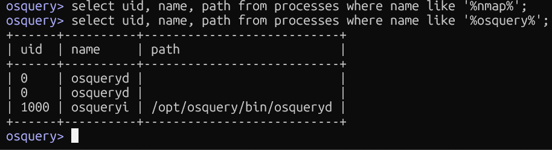

## Checking if a Package/Process is Running

### Queries Used
```sql
-- Check if nmap is running
select uid, name, path from processes where name like '%nmap%';

-- Check if osquery itself is running
select uid, name, path from processes where name like '%osquery%';
```

### Screenshot


### Blue Team Relevance
- Confirm whether a **suspected malicious process** is actively running
- Verify that **security tools** (osqueryd, auditd, etc.) are actually running
- Detect **unauthorized processes** running under unexpected UIDs
