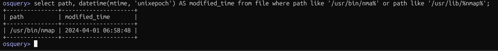

## Checking File Modification Time of a Binary

### Query Used
```sql
select path, datetime(mtime, 'unixepoch') AS modified_time 
from file 
where path like '/usr/bin/nma%' or path like '/usr/lib/%nmap%';
```

### Screenshot


### What It Does
Pulls the last modification timestamp of a binary from the `file` table using Unix epoch conversion.

### Blue Team Relevance
- Detect **recently modified or replaced binaries** (a common persistence technique)
- Useful in **malware investigations** — attackers often replace legit binaries
- Compare `mtime` against known-good baselines to spot **tampering**
