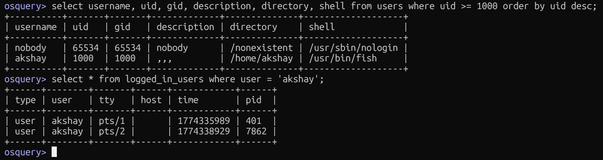

## Detecting Users and Checking Login Status

### Queries Used
```sql
-- List all human user accounts (UID >= 1000)
select username, uid, gid, description, directory, shell 
from users 
where uid >= 1000 
order by uid desc;

-- Check if a specific user is currently logged in
select * from logged_in_users where user = 'akshay';
```

### Screenshot


### Blue Team Relevance
- Detect **newly created user accounts** (common persistence method)
- Verify **who is currently logged in** during an active incident
- Multiple active sessions for one user can indicate **session hijacking**
- `uid >= 1000` filters out system accounts, focusing on human users
